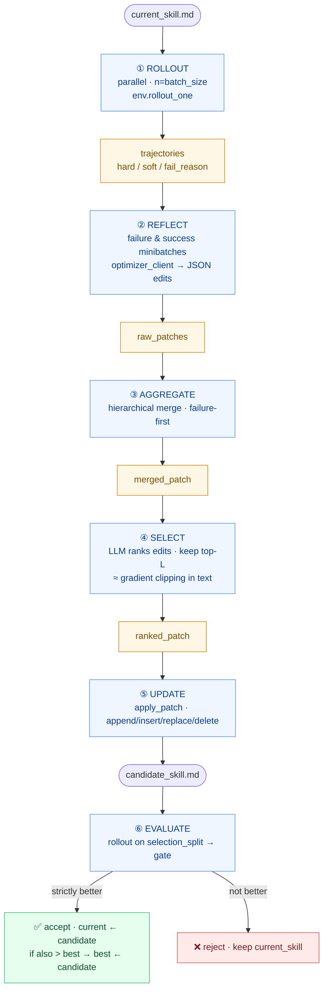

<div align="center">

# 🧠 skillrl

### *The TRL of skill / prompt-space optimization.*

**A clean, modular Python library for end-to-end optimization of LLM-agent *skills* — no fine-tuning required.**

Built on the core algorithm of Microsoft **[SkillOpt](https://microsoft.github.io/SkillOpt/)** · API designed in the spirit of 🤗 **[TRL](https://github.com/huggingface/trl)**.

<br />

[](https://pypi.org/project/skillrl/)
[](https://pypi.org/project/skillrl/)
[](LICENSE)
[](https://github.com/Xia12121/SkillRL)

```bash
pip install skillrl
```

</div>

---

## ✨ Why skillrl?

Modern LLM agents are usually improved in one of two ways:

- 🔧 **Fine-tune the weights** — expensive, opaque, often impossible if the model is closed-source.
- ✍️ **Hand-tweak the prompt** — cheap but brittle, ad-hoc, and notoriously hard to reproduce.

**SkillOpt** proposed a third path: treat a **natural-language *skill document*** (a markdown file of guidelines, heuristics, do/don'ts) as the *trainable state*. Both the **target LLM** (the agent that uses the skill) and the **optimizer LLM** (the model that critiques and rewrites the skill) stay **frozen**. Gradient descent is replaced by a textual analogue:

<table>
<thead>
<tr><th align="center">SGD on weights</th><th align="center">SkillOpt on skill text</th></tr>
</thead>
<tbody>
<tr><td>Forward pass</td><td><b>① Rollout</b> — target agent runs the skill on a batch</td></tr>
<tr><td>Backward pass <code>∂L/∂θ</code></td><td><b>② Reflect</b> — optimizer LLM analyses success / failure → candidate edits</td></tr>
<tr><td>Gradient accumulation</td><td><b>③ Aggregate</b> — hierarchical merge into one coherent patch</td></tr>
<tr><td>Gradient clipping / <code>lr</code></td><td><b>④ Select</b> — rank edits, keep top-<code>L</code> (the <i>edit budget</i>)</td></tr>
<tr><td><code>optimizer.step()</code></td><td><b>⑤ Update</b> — deterministically apply edits to the skill doc</td></tr>
<tr><td>Validation</td><td><b>⑥ Evaluate</b> — held-out gate, accept iff strictly better</td></tr>
</tbody>
</table>

**`skillrl`** packages this 6-stage pipeline as a **TRL-style** library, so you can write:

```python
trainer = SkillOptTrainer(config=cfg, env=env, optimizer_client=..., target_client=...)
summary = trainer.train()
```

…just like you'd write `PPOTrainer(...).train()` in 🤗 TRL.

---

## 📑 Table of Contents

- [✨ Why skillrl?](#-why-skillrl)
- [🆚 TRL ↔ skillrl mapping](#-trl--skillrl-mapping)
- [🚀 Installation](#-installation)
- [⚡ Quick start](#-quick-start)
- [🔁 The 6-stage pipeline](#-the-6-stage-pipeline)
- [📦 Library structure](#-library-structure)
- [🛠 Writing your own environment](#-writing-your-own-environment)
- [🎨 Customising prompts](#-customising-prompts)
- [🔍 Reproducibility & observability](#-reproducibility--observability)
- [🗺 Roadmap](#-roadmap)
- [📚 Acknowledgements](#-acknowledgements)
- [📄 License](#-license)

---

## 🆚 TRL ↔ skillrl mapping

<table>
<thead>
<tr><th>🤗 TRL</th><th>skillrl</th></tr>
</thead>
<tbody>
<tr><td><code>PPOConfig</code> (dataclass)</td><td><code>SkillOptConfig</code> (dataclass)</td></tr>
<tr><td><code>PPOTrainer.train()</code></td><td><code>SkillOptTrainer.train()</code></td></tr>
<tr><td>Reward model</td><td><code>SkillEnv</code> — <code>rollout_one</code> returns <code>hard</code> / <code>soft</code> / <code>fail_reason</code></td></tr>
<tr><td>Policy model (trainable)</td><td><b>Skill document</b> (markdown, trainable)</td></tr>
<tr><td>Reference / value model</td><td>Frozen <b><code>target_client</code></b></td></tr>
<tr><td>Optimizer (Adam)</td><td>Frozen <b><code>optimizer_client</code></b> + edit-budget scheduler</td></tr>
<tr><td>Learning rate</td><td><code>edit_budget</code> + <code>lr_scheduler</code> (constant / linear / cosine)</td></tr>
<tr><td>Gradient clipping</td><td>LLM-based ranking — keeps top-<code>L</code> edits</td></tr>
<tr><td>Validation reward</td><td><code>selection_split</code> gate (<code>hard</code> / <code>soft</code> / <code>mixed</code>)</td></tr>
</tbody>
</table>

---

## 🚀 Installation

From PyPI (recommended):

```bash
pip install skillrl
```

From source (editable, for hacking on the library itself):

```bash
git clone https://github.com/Xia12121/SkillRL.git
cd SkillRL
pip install -e .[dev]
```

> **Requirements:** Python ≥ 3.10 · `openai>=1.40.0`
> Any OpenAI-compatible endpoint works out of the box: vLLM · Together · Azure · DeepSeek · Moonshot · …

---

## ⚡ Quick start

A minimal, end-to-end example using the bundled `SimpleQAEnv`:

```python
from skillrl import SkillOptConfig, SkillOptTrainer
from skillrl.envs.qa import SimpleQAEnv
from skillrl.llm.openai_client import OpenAIChatClient

# 1. Data ────────────────────────────────────────────────────────────────
train = [
    {"id": "1", "question": "Capital of France?",      "answers": ["Paris"]},
    {"id": "2", "question": "Largest ocean on Earth?", "answers": ["Pacific Ocean", "Pacific"]},
    # ... 30+ items recommended
]
val  = [{"id": "v1", "question": "Capital of Japan?", "answers": ["Tokyo"]}]
test = [{"id": "t1", "question": "Capital of Italy?", "answers": ["Rome"]}]

env = SimpleQAEnv(train_items=train, val_items=val, test_items=test)

# 2. Backends ────────────────────────────────────────────────────────────
optimizer = OpenAIChatClient(model="gpt-4o")           # critic / rewriter
target    = OpenAIChatClient(model="gpt-4o-mini")      # the frozen agent

# 3. Config (paper-default protocol) ────────────────────────────────────
cfg = SkillOptConfig(
    num_epochs     = 2,
    batch_size     = 8,
    minibatch_size = 4,
    edit_budget    = 4,
    lr_scheduler   = "cosine",
    gate_metric    = "hard",
    out_root       = "outputs/qa_demo",
)

# 4. Train ──────────────────────────────────────────────────────────────
trainer = SkillOptTrainer(
    config           = cfg,
    env              = env,
    optimizer_client = optimizer,
    target_client    = target,
    initial_skill    = "You are a concise QA assistant. Answer in one short phrase.",
)
summary = trainer.train()
print(summary["best_selection_score"], summary["test_hard"])
```

▶️ **Runnable version:** [`examples/train_qa.py`](examples/train_qa.py)

<details>
<summary><b>📂 What gets written to <code>out_root/</code></b></summary>

```text
outputs/qa_demo/
├── config.json                 # resolved config
├── best_skill.md               # all-time best skill (deploy this)
├── current_skill.md            # last accepted skill
├── history.json                # per-step records
├── runtime_state.json          # for auto-resume
├── summary.json                # final report
├── skills/
│   ├── skill_v0001.md          # per-step snapshots
│   └── ...
├── steps/
│   └── step_0000/
│       ├── rollout_results.json
│       ├── raw_patches.json
│       ├── merged_patch.json
│       ├── ranked_patch.json
│       ├── candidate_skill.md
│       ├── edit_apply_report.json
│       ├── selection_eval/      # validation rollouts on this candidate
│       └── step_record.json
├── test_eval_baseline/
└── test_eval_best/
```

If you re-launch with the same `out_root`, training **auto-resumes** from the last completed step.

</details>

---

## 🔁 The 6-stage pipeline



> 💡 **Edit budget = textual learning rate.** The cap on edits applied per step is decayed (constant / linear / cosine) over the training horizon, exactly as the SkillOpt paper does.
>
> 🛡 **Validation gate is strict.** Candidates must *strictly* beat `current_score`. A separate `best_skill` is tracked in parallel, so the artifact you ship is always the all-time best.

---

## 📦 Library structure

```text
skillrl/
├── __init__.py            # public exports
├── config.py              # SkillOptConfig (dataclass)
├── types.py               # Edit / Patch / RawPatch / RolloutResult / GateResult
├── trainer.py             # SkillOptTrainer — the main loop
│
├── core/
│   ├── editor.py          # apply_edit / apply_patch  ← stage ⑤
│   ├── scheduler.py       # constant / linear / cosine edit-budget schedulers
│   ├── gate.py            # validation gate (hard / soft / mixed)
│   └── utils.py           # extract_json, compute_score, skill_hash
│
├── llm/
│   ├── base.py            # BaseLLMClient interface
│   └── openai_client.py   # OpenAI / Azure / OpenAI-compatible
│
├── pipeline/
│   ├── rollout.py         # ① parallel rollouts
│   ├── reflect.py         # ② failure / success minibatch reflection
│   ├── aggregate.py       # ③ hierarchical merge (failure-first)
│   └── select.py          # ④ LLM rank + top-L clip
│
├── prompts/               # bundled markdown prompt templates (overridable)
│   ├── analyst_error.md
│   ├── analyst_success.md
│   ├── merge_failure.md
│   ├── merge_success.md
│   ├── merge_final.md
│   └── ranking.md
│
└── envs/
    ├── base.py            # SkillEnv abstract class
    └── qa.py              # SimpleQAEnv (reference implementation)
```

---

## 🛠 Writing your own environment

To train a skill on **your** task, subclass `SkillEnv`:

```python
from skillrl.envs.base import SkillEnv
from skillrl.types import RolloutResult

class MyEnv(SkillEnv):
    name = "my_env"

    def get_initial_skill(self) -> str:
        return "You are an expert XYZ agent..."

    def get_items(self, split: str) -> list[dict]:
        return self._splits[split]            # train / val / test

    def rollout_one(self, *, item, skill, target_client) -> RolloutResult:
        # 1) build the conversation; the *skill* is typically the system prompt.
        # 2) call target_client.chat(...) one or more times (multi-turn allowed).
        # 3) score the outcome:  hard ∈ {0, 1},  soft ∈ [0, 1].
        # 4) return RolloutResult(...).
        ...
```

Drop it into `SkillOptTrainer` and you're training.

> 🔎 **Tip.** For multi-turn / tool-using agents, return the full `conversation` list and a meaningful `fail_reason`. The Reflect stage uses both to localise *why* the skill failed and *what* to change.

---

## 🎨 Customising prompts

All optimizer-LLM prompts live in `skillrl/prompts/*.md`. Override any of them per-trainer **without modifying the package**:

```python
trainer = SkillOptTrainer(
    config=cfg, env=env,
    optimizer_client=opt, target_client=tgt,
    prompt_overrides={
        "analyst_error": open("my_prompts/analyst_error.md").read(),
        "ranking":       open("my_prompts/ranking.md").read(),
    },
)
```

**Available keys:** `analyst_error` · `analyst_success` · `merge_failure` · `merge_success` · `merge_final` · `ranking`

---

## 🔍 Reproducibility & observability

- 🎯 **Determinism.** The same `seed`, `batch_size`, `minibatch_size`, dataset and backends produce the same minibatch shuffles and analyst groupings.
- ♻️ **Auto-resume.** Re-running with the same `out_root` skips already-completed steps (rebuilds the selection cache from `history.json`).
- 🧾 **Per-step artifacts.** Every stage's input/output is dumped — easy to diff between steps and reproduce any single step locally.
- 💸 **Selection cache.** Identical candidate skills (by `skill_hash`) reuse cached selection-split scores — saves a *lot* of money on long runs.

---

## 🗺 Roadmap

`skillrl 1.0` ships the **core algorithm** as faithfully as possible. The following SkillOpt features are intentionally deferred to future minor releases:

- [ ] `slow_update` — skill momentum / EMA over accepted skills
- [ ] `meta_skill` — a meta-document guiding *how* to edit the skill
- [ ] Autonomous LR — online edit-budget tuning
- [ ] Gradient accumulation across steps
- [ ] `rewrite` / `full_rewrite_minibatch` update modes
- [ ] Codex / Claude-Code / Qwen / MiniMax execution backends
- [ ] Ray-based distributed rollouts
- [ ] WebUI

PRs welcome. 💌

---

## 📚 Acknowledgements

`skillrl` reimplements and packages the algorithm originally proposed in:

> **Optimizing LLM Agent Skills End-to-End** — Microsoft Research
> [Project page](https://microsoft.github.io/SkillOpt/) · [GitHub](https://github.com/microsoft/SkillOpt)

API design takes inspiration from 🤗 **[TRL](https://github.com/huggingface/trl)** (Transformers Reinforcement Learning).

This repo is an **independent** Python implementation focused on a clean, library-grade API; it is not affiliated with Microsoft.

---

## 📄 License

[MIT](LICENSE) © skillrl contributors

<div align="center">

<sub>Built with ❤️ for everyone who'd rather train a markdown file than a billion weights.</sub>

</div>
